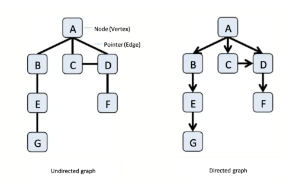
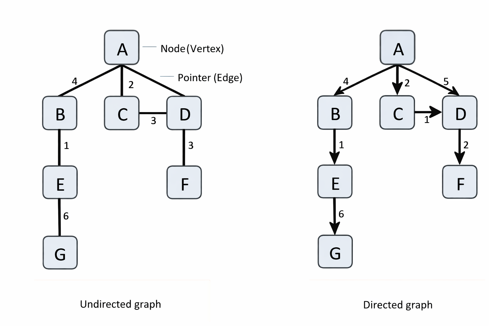
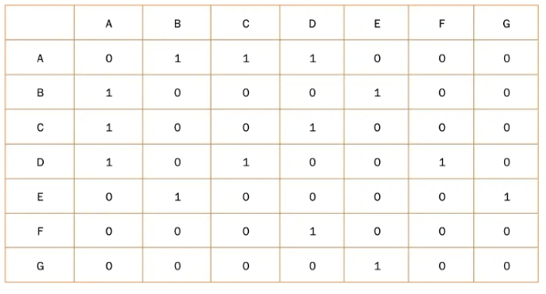

# Graphs

## What is a Graph?

A graph is a non-linear data structure consisting of vertices (representing individual data points or entities) and edges (the connections between them that represent relationships).

### Key Distinctions
### Graphs vs. Trees
Graphs differ from Trees or Linked Lists. Where a Tree is a strictly hierarchical structure with a single root and no cycles, a Graph is a more general network where any vertex can connect to any other, allowing for multiple paths, cycles, and even self-loops.

### Graphs vs. Linked Lists
While a Linked List is a linear sequence where each vertex point to exactly one successor, a graph is a nonlinear network where any vertex can connect to multiple others, forming complex paths and cycles. 

## Directed vs Undirected Graphs

Graphs can be classified based on whether their edges have direction.

### Undirected Graphs

In an **undirected graph**, edges have no direction.  
If there is an edge between A and B, the connection works both ways.

Formally, an edge is represented as an **unordered pair**:
(A, B) = (B, A)

This means:
- movement between vertices is symmetric
- relationships are mutual

Examples include:
- friendships in social networks
- physical connections like roads (when travel is possible both ways)

In an adjacency list, undirected edges are typically stored twice:

A -> B<br>
B -> A


---

### Directed Graphs

In a **directed graph (digraph)**, edges have a specific direction.

An edge from A to B does **not** imply an edge from B to A.

Formally, edges are **ordered pairs**:
(A, B) ≠ (B, A)

This means:
- relationships are not necessarily mutual
- traversal must follow edge direction

Examples include:
- social media followers (A follows B)
- web links (page A links to page B)
- task dependencies (A must happen before B)

In an adjacency list, edges are stored only in one direction:

A -> B


---

### Key Differences

| Feature | Undirected Graph | Directed Graph |
|--------|----------------|----------------|
| Edge type | Unordered pair | Ordered pair |
| Direction | None | One-way |
| Symmetry | Yes | Not necessarily |
| Storage | Two entries per edge | One entry per edge |

---

### Why This Matters

The choice between directed and undirected graphs affects:

- **Traversal**: In directed graphs, some vertices may not be reachable
- **Pathfinding**: Direction restricts valid paths
- **Representation**: Undirected graphs require storing edges twice in adjacency lists

## Weighted vs Unweighted Graphs

Graphs can also be classified based on whether edges carry additional values.

### Unweighted Graphs

In an **unweighted graph**, edges do not store any additional information — they only represent whether a connection exists.

This means:
- all edges are treated equally
- traversal is based purely on structure

Unweighted graphs are typically used for:
- checking connectivity between vertices
- finding the shortest path in terms of **number of edges**

For example, in a road network where all roads are considered equal, the goal might be to minimise the number of steps rather than distance.

---

### Weighted Graphs

In a **weighted graph**, each edge has an associated value (weight).

A weight represents a measurable quantity such as:
- distance
- time
- cost
- capacity

This means:
- edges are no longer equal
- traversal must consider edge weights when determining optimal paths

Weighted graphs are used in problems such as:
- finding the shortest route (minimum distance)
- minimising cost (e.g. cheapest flights)
- optimising resource usage

---

### Key Differences

| Feature | Unweighted Graph | Weighted Graph |
|--------|----------------|----------------|
| Edge value | None | Numerical weight |
| Edge importance | All equal | Varies by weight |
| Shortest path meaning | Fewest edges | Minimum total weight |
| Algorithm used | BFS | Dijkstra’s algorithm (or similar) |

---

### Why This Matters

The presence of weights changes how algorithms operate:

- In an **unweighted graph**, BFS can be used to find the shortest path efficiently  
- In a **weighted graph**, BFS is no longer sufficient, as it ignores weights  
- Instead, algorithms such as **Dijkstra’s algorithm** are required  

This distinction is important because it determines:
- which algorithms are valid
- how paths are evaluated
- how the graph must be stored and processed

## Python Implementations

Graphs can be represented in Python using an **adjacency list**, typically implemented with dictionaries.

In this structure:
- each key represents a vertex
- the value represents its neighbouring vertices

This allows for efficient storage, especially for sparse graphs.

--- 

### Undirected Graph

```
graph = {
    "A":["B","C","D"],
    "B":["A","E"],
    "C":["A","D"],
    "D":["A","C","F"],
    "E":["B","G"],
    "F":["D"],
    "G":["E"]
}
```

In this representation:
- edges are stored **in both direction**
- if A is connected to B, then B is also connected to A

This reflects the definition of an **undirected graph**

--- 

### Directed Graph

```
graph = {
    "A":["B","C","D"],
    "B":["E"],
    "C":["D"],
    "D":["F"],
    "E":["G"],
    "F":[], 
    "G":[]
} 
```

Here:
- edges are stored **in one direction**
- for example, A -> B exists, but B -> A does not

This matches the behaviour of a **directed graph**.

--- 

### Weighted Graph

```
graph = {
    "A":{
        "B":2,
        "C":6,
        "D":3
    }
}
```

In this case:
- the value is a **dictionary instead of a list**
- each neighbour is mapped to a **weight**

This allows for storing additional information such as distance or cost.

---

Weighted and directed graph in python
```
graph = {
    "A":{"B":2,"C":6,"D":3},
    "B":{"E":4},
    "C":{"D":1},
    "D":{"F":5},
    "E":{"G":3},
    "F":{},
    "G":{}
}
```







## Adjacency list vs Adjacency matrix

Graphs are typically stored as objects or dictionaries known as **adjacency lists** they can also be stored as a 2D array or a list of lists. This implementation is known as an **adjacency matrix** with rows and columns representing verticies and edges. An example of an adjacency matrix for the undirected graph is shown below





## Real-world applications
graphs in computer science have many uses. For example mapping road netowrks for navigation systems, storing social network data, resource allocation in operatnig systems and many others.

## traversal concepts
