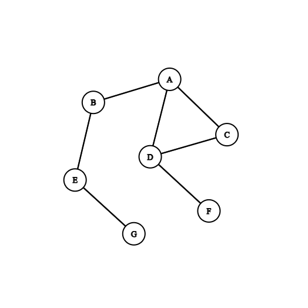
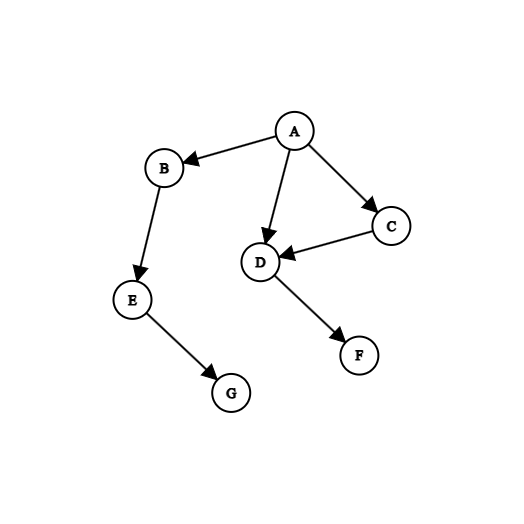
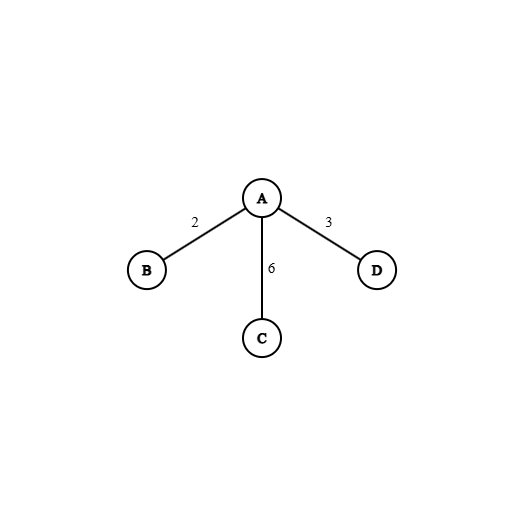

# Graphs

## What is a Graph?

A graph is a non-linear data structure consisting of vertices (nodes) and edges, where vertices represent entities and edges represent relationships between them.

### Key Distinctions

#### Graphs vs. Trees
A tree is a restricted type of graph with a hierarchical structure, no cycles, and a single root. In contrast, a general graph has no such restrictions and may contain cycles and multiple paths between vertices.

#### Graphs vs. Linked Lists
A linked list is a linear structure where each vertex typically connects to a single next element, forming a simple chain rather than a network.

## Directed vs Undirected Graphs

Graphs can be classified based on whether their edges have direction.

### Undirected Graphs

In an **undirected graph**, edges have no direction.  
If there is an edge between A and B, the connection works both ways.

Formally, an edge is represented as an **unordered pair**:
(A, B) = (B, A)

This means:
- movement between vertices is symmetric
- relationships are mutual

Examples include:
- friendships in social networks
- physical connections like roads (when travel is possible both ways)

In an adjacency list, undirected edges are typically stored twice:

```
A → B
B → A
```


---

### Directed Graphs

In a **directed graph (digraph)**, edges have a specific direction.

An edge from A to B does **not** imply an edge from B to A.

Formally, edges are **ordered pairs**:
(A, B) ≠ (B, A)

This means:
- relationships are not necessarily mutual
- traversal must follow edge direction

Examples include:
- social media followers (A follows B)
- web links (page A links to page B)
- task dependencies (A must happen before B)

In an adjacency list, edges are stored only in one direction:
```
A → B
```

---

### Key Differences

| Feature | Undirected Graph | Directed Graph |
|--------|----------------|----------------|
| Edge type | Unordered pair | Ordered pair |
| Direction | None | One-way |
| Symmetry | Yes | Not necessarily |
| Storage | Two entries per edge | One entry per edge |

---

### Why This Matters

The choice between directed and undirected graphs affects:

- **Traversal**: In directed graphs, some vertices may not be reachable
- **Pathfinding**: Direction restricts valid paths
- **Representation**: Undirected graphs require storing edges twice in adjacency lists

## Weighted vs Unweighted Graphs

Graphs can also be classified based on whether edges carry additional values.

### Unweighted Graphs

In an **unweighted graph**, edges do not store any additional information — they only represent whether a connection exists.

This means:
- all edges are treated equally
- traversal is based purely on structure

Unweighted graphs are typically used for:
- checking connectivity between vertices
- finding the shortest path in terms of **number of edges**

For example, in a road network where all roads are considered equal, the goal might be to minimise the number of steps rather than distance.

---

### Weighted Graphs

In a **weighted graph**, each edge has an associated value (weight).

A weight represents a measurable quantity such as:
- distance
- time
- cost
- capacity

This means:
- edges are no longer equal
- traversal must consider edge weights when determining optimal paths

Weighted graphs are used in problems such as:
- finding the shortest route (minimum distance)
- minimising cost (e.g. cheapest flights)
- optimising resource usage

---

### Key Differences

| Feature | Unweighted Graph | Weighted Graph |
|--------|----------------|----------------|
| Edge value | None | Numerical weight |
| Edge importance | All equal | Varies by weight |
| Shortest path meaning | Fewest edges | Minimum total weight |
| Algorithm used | BFS | Dijkstra’s algorithm (or similar) |

---

### Why This Matters

The presence of weights changes how algorithms operate:

- In an **unweighted graph**, BFS can be used to find the shortest path efficiently  
- In a **weighted graph**, BFS is no longer sufficient, as it ignores weights  
- Instead, algorithms such as **Dijkstra’s algorithm** are required  

This distinction is important because it determines:
- which algorithms are valid
- how paths are evaluated
- how the graph must be stored and processed

## Python Implementations

Graphs can be represented in Python using an **adjacency list**, typically implemented with dictionaries.  
This is the representation used throughout the implementation in this project.

In this structure:
- each key represents a vertex
- the value represents its neighbouring vertices

This allows for efficient storage, especially for sparse graphs.

--- 

### Undirected Graph

```
graph = {
    "A":["B","C","D"],
    "B":["A","E"],
    "C":["A","D"],
    "D":["A","C","F"],
    "E":["B","G"],
    "F":["D"],
    "G":["E"]
}
```

In this representation:
- edges are stored **in both directions** in the adjacency list representation
- if A is connected to B, then B is also connected to A

This reflects the definition of an **undirected graph**



This diagram shows that each connection appears in both directions (e.g. A ↔ B), matching how the adjacency list stores edges twice (A → B and B → A).

--- 

### Directed Graph

```
graph = {
    "A":["B","C","D"],
    "B":["E"],
    "C":["D"],
    "D":["F"],
    "E":["G"],
    "F":[], 
    "G":[]
} 
```

Here:
- edges are stored **in one direction**
- for example, A → B exists, but B → A does not

This reflects the definition of a **directed graph**, where connections are one-way.



This diagram shows that edges have direction (e.g. A → B but not B → A), matching the adjacency list where connections are only stored in one direction.

--- 

### Weighted Graph

```
graph = {
    "A":{
        "B":2,
        "C":6,
        "D":3
    }
}
```

In this case:
- the value is a **dictionary instead of a list**
- each neighbour is mapped to a **weight**

This allows for storing additional information such as distance or cost.



This diagram shows weights labelled on each edge (e.g. A → B has weight 2), matching the adjacency list where each neighbour is mapped to a numerical value instead of just being listed.

---

### Weighted and Directed Graph

```
graph = {
    "A":{"B":2,"C":6,"D":3},
    "B":{"E":4},
    "C":{"D":1},
    "D":{"F":5},
    "E":{"G":3},
    "F":{},
    "G":{}
}
```
This combines both concepts:
- edges have direction
- edges carry weights


This diagram shows both direction and weight (e.g. A → B with weight 2), matching the adjacency list where edges are stored as key-value pairs and only exist in one direction.
---

## Adjacency List vs Adjacency Matrix

Graphs can be represented in multiple ways, the two most common being **adjacency lists** and **adjacency matrices**.

---

### Adjacency List

An **adjacency list** stores, for each vertex, a list (or dictionary) of its neighbouring vertices.

In Python, this is typically implemented using a dictionary:
- keys represent vertices
- values represent their neighbours

This is the representation used throughout this project.

Example:
```
A → [B, C, D]
B → [A, E]
```

**Advantages:**
- Efficient for **sparse graphs** (few edges)
- Uses less memory (O(V + E))
- Fast to iterate over neighbours

**Disadvantages:**
- Slower to check if a specific edge exists
- Structure is slightly more complex than a matrix

---

### Adjacency Matrix

An **adjacency matrix** is a 2D array where:
- rows represent starting vertices
- columns represent destination vertices

A value indicates whether an edge exists (or stores a weight).

Example:
```
    A B C D
A [ 0 1 1 1 ]
B [ 1 0 0 0 ]
C [ 1 0 0 1 ]
D [ 1 0 1 0 ]
```


**Advantages:**
- Very fast edge lookup (O(1))
- Simple and easy to understand

**Disadvantages:**
- Uses more memory (O(V²))
- Inefficient for sparse graphs

---

### Key Differences

| Feature | Adjacency List | Adjacency Matrix |
|--------|----------------|------------------|
| Storage | O(V + E) | O(V²) |
| Edge lookup | Slower | Fast (O(1)) |
| Memory use | Efficient | Expensive |
| Best for | Sparse graphs | Dense graphs |

---

### Why This Matters

The choice of representation affects both performance and usability:

- **Adjacency lists** are better when the graph has relatively few edges  
- **Adjacency matrices** are better when fast edge lookup is required  

In this project, an adjacency list was chosen because:
- the graph is relatively sparse  
- efficient traversal (BFS/DFS) is required  
- it aligns naturally with Python dictionary structures  

## Real-World Applications of Graphs

Graphs are widely used to model real-world systems where relationships between entities are important.

---

### Navigation and Road Networks

In navigation systems, graphs are used to represent road networks.

- **Vertices** represent locations (e.g. cities or intersections)
- **Edges** represent roads connecting them
- **Weights** can represent distance or travel time

This allows algorithms to find the shortest or fastest route between two points.

---

### Social Networks

Graphs are used to model relationships between people.

- **Vertices** represent users
- **Edges** represent relationships (e.g. friendships or followers)

Directed graphs are often used for platforms like Twitter, where relationships are not always mutual.

---

### Computer Networks

Graphs model how devices are connected in a network.

- **Vertices** represent devices (e.g. routers or computers)
- **Edges** represent communication links

This helps in routing data efficiently and detecting network failures.

---

### Task Scheduling and Dependencies

Graphs are used to represent dependencies between tasks.

- **Vertices** represent tasks
- **Edges** represent dependencies (A must be completed before B)

These are typically **directed graphs**, and are used in:
- project planning
- build systems
- operating systems

---

### Why Graphs Are Suitable

Graphs are useful because they:
- model relationships clearly
- allow efficient traversal and pathfinding
- can represent both simple and complex systems

This makes them a flexible and powerful data structure for many real-world problems.They also allow the application of standard algorithms (such as BFS, DFS, and shortest path algorithms), making them highly practical.