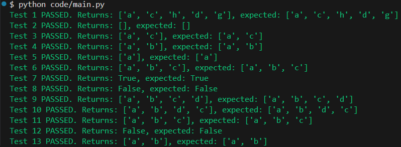

# Section 3: Testing, Evaluation and Reflection

## Testing Strategy

A structured testing approach was used to validate both the correctness and robustness of the graph implementation.

The goal of testing was to ensure:
- correct traversal behaviour (BFS and DFS)
- correct handling of graph operations (adding/removing vertices and edges)
- robustness against edge cases (e.g. cycles, self-loops, empty graphs)
- correctness of path existence checking

Tests were designed to cover both **typical usage scenarios** and **edge cases**, ensuring the implementation behaves reliably under different conditions.

---

## Test Design

Test cases were grouped into categories to ensure all aspects of the system were validated.

### Core Functionality

These tests verify that the main traversal algorithms work correctly on standard graphs.

- BFS traversal from a starting node  
- DFS traversal on a linear structure  

Example:
- `t1`: BFS traversal on a connected graph  
- `t9`: DFS traversal on a linear graph  

These confirm that the graph is stored correctly and that traversal visits all reachable vertices.

---

### Structural Integrity

These tests ensure that the graph remains valid after modification operations.

- Removing a vertex and ensuring edges are cleaned up  
- Adding edges that implicitly create vertices  
- Removing non-existent edges safely  

Examples:
- `t3`: Removing a vertex and ensuring stale edges are removed  
- `t4`: Adding an edge where vertices do not yet exist  
- `t13`: Attempting to remove a non-existent edge  

These tests confirm that the graph maintains consistency after updates.

---

### Edge Cases

These tests focus on scenarios that often cause logical errors in graph implementations.

- Empty graph  
- Self-loops  
- Cycles  
- Disconnected graphs  

Examples:
- `t2`: Empty graph handling  
- `t5`: Self-loop behaviour  
- `t6`, `t11`: Cycle handling  
- `t12`: Unreachable vertex detection  

These are important because:
- cycles can cause infinite loops if visited tracking is incorrect  
- self-loops test whether a node is revisited incorrectly  
- disconnected graphs ensure traversal does not include unreachable nodes  

---

### Logical Correctness

These tests verify higher-level behaviour of the graph.

- Path existence between vertices  

Examples:
- `t7`: Path exists  
- `t8`: Path does not exist  

These confirm that the BFS-based path checking algorithm functions correctly.

---

## Test Results

All implemented test cases passed successfully.

Each test compared the **expected output** with the **actual output**, confirming that:
- traversal orders were correct
- graph operations behaved as intended
- edge cases were handled without errors

The use of automated tests ensured consistency and allowed rapid validation after changes.

An example screenshot of such test results is shown below:

---

## BFS vs DFS Evaluation

The implementation demonstrates clear differences between BFS and DFS.

### Breadth-First Search (BFS)

- Explores the graph level-by-level  
- Uses a queue (FIFO)  
- Guarantees shortest path in unweighted graphs  

In testing, BFS produced traversal orders that reflect increasing distance from the starting node.

---

### Depth-First Search (DFS)

- Explores as deeply as possible before backtracking  
- Uses recursion (implicit stack)  
- Does not guarantee shortest path  

In tests such as `t10`, DFS explores one branch fully before moving to another, demonstrating its depth-first nature.

---

### Comparison

| Feature | BFS | DFS |
|--------|-----|-----|
| Structure | Queue | Stack / recursion |
| Exploration | Level-by-level | Deep exploration |
| Shortest path | Yes (unweighted) | No |
| Use case | Shortest path, connectivity | Full exploration, cycle detection |

This comparison shows that both algorithms are suited to different types of problems.

---

## Evaluation of Representation

The graph uses an **adjacency list** representation.

### Advantages

- Efficient memory usage: O(V + E)  
- Fast iteration over neighbours  
- Well-suited for sparse graphs  

### Limitations

- Slower edge lookup compared to adjacency matrix  
- Slightly more complex structure  

Overall, the adjacency list was appropriate because:
- the graph is relatively sparse  
- traversal operations (BFS/DFS) are the primary focus  

---

## Complexity Analysis

The main operations have the following time complexities:

- Add vertex: O(1)  
- Add edge: O(1)  
- Remove edge: O(1)  
- Remove vertex: O(V + E)  
- BFS traversal: O(V + E)  
- DFS traversal: O(V + E)  
- Path existence check: O(V + E)  

This shows that the implementation scales efficiently with graph size.

---

## Limitations and Improvements

Although the implementation is functional, several improvements could be made:

- **Weighted graphs**: Currently, edge weights are not used. This could be extended to support algorithms such as Dijkstra’s algorithm.  
- **Undirected graph support**: The current implementation is directed only. Adding bidirectional edges would allow more flexibility.  
- **Iterative DFS**: An explicit stack-based DFS could be implemented to avoid recursion limits.  
- **Visualisation**: A graphical representation of the graph could improve usability and debugging.  

---

## Team Contribution

The project was completed as a group, however responsibilities were divided unevenly.

I was primarily responsible for the design and implementation of the graph system in Section 2, including the adjacency list structure, BFS and DFS algorithms, and additional operations such as vertex/edge management and path checking. I also designed and implemented all test cases used in this section, including edge cases such as cycles, self-loops, and disconnected graphs.

Tom initially contributed to Section 1 by drafting the theoretical explanation of graphs. This was later refined and expanded to improve clarity and accuracy.

Some collaboration took place when discussing overall structure and ensuring consistency between sections, but the majority of the technical implementation and testing was completed independently.

---

## Conclusion

The testing process demonstrates that the graph implementation is correct, robust, and capable of handling a wide range of scenarios.

Both BFS and DFS are implemented effectively and behave as expected, and the chosen adjacency list representation provides an efficient and suitable structure for the problem.

Overall, the system meets its objectives and provides a strong foundation for further extensions.